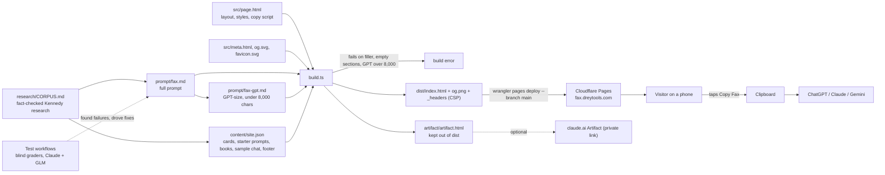

# Just Fax: how the pieces fit

Status as of 2026-09-25: live at https://fax.dreytools.com (Cloudflare Pages project "justfax", also at justfax.pages.dev).

- The Copy buttons read the prompt straight out of the page, so what people read is exactly what they copy.
- Nothing is collected from visitors: no forms, no analytics, no email capture (see README launch rules).
